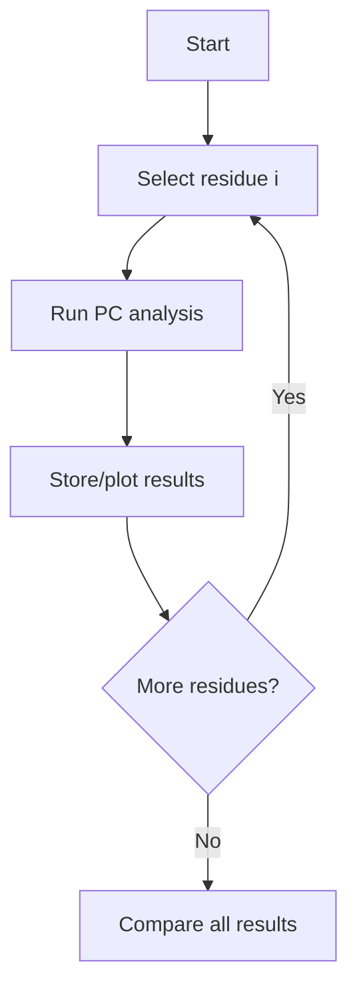

# Residue Selection Guide

Selecting the right residue for perturbation is crucial for meaningful allosteric network analysis. This guide summarizes best practices, scientific rationale, and literature-based strategies for residue selection.

---

## 1. Functional and Allosteric Sites
- **Active Site Residues:** If known, start with residues in the catalytic or ligand-binding site. These are often the most biologically relevant for perturbation studies.
- **Allosteric Pockets:** Use literature, structural databases (e.g., Allosteric Database, PDB), or prediction tools to identify allosteric sites. See [PMC3195717](https://pmc.ncbi.nlm.nih.gov/articles/PMC3195717/) for examples.

> **Example:** In kinases, the DFG motif or activation loop residues are often chosen as perturbation sites due to their regulatory role.

## 2. Conserved Residues
- Highly conserved residues (from sequence alignments or tools like ConSurf) are often functionally important and good candidates for perturbation. See [PMC3282753](https://pmc.ncbi.nlm.nih.gov/articles/PMC3282753/).

> **Tip:** Use multiple sequence alignment to identify conserved positions.

## 3. Experimental Data
- Use mutagenesis, NMR, HDX-MS, or other experimental data to guide selection.
- Literature mining can reveal residues critical for function, regulation, or disease.

> **Example:** Mutations at allosteric hotspots identified in [Tandfonline 2013](https://www.tandfonline.com/doi/full/10.1080/07391102.2013.855145?needAccess=true#d1e164) can be used as perturbation points.

## 4. Exploratory and Systematic Approaches
- If no prior knowledge exists, try a systematic scan: perturb each residue in turn and compare the resulting PC landscapes.
- Use the GUI to visually explore and select residues of interest.
- For large proteins, focus on domains or regions of interest to reduce computational cost.

> **Mermaid Diagram: Systematic Scan Workflow**


## 5. Practical Tips
- Avoid residues at chain termini or with missing coordinates.
- Check for alternate conformations or unresolved regions in the PDB file.
- For membrane proteins, consider both transmembrane and loop regions.

---

## Example Workflow

1. **Start with the active site or a known allosteric site.**
2. **If results are inconclusive, try conserved or structurally central residues.**
3. **For discovery, perform a systematic scan.**

---

## Literature & Resources
- [Allosteric Database (ASD)](http://mdl.shsmu.edu.cn/ASD/)
- [ConSurf Server](https://consurf.tau.ac.il/)
- [PDB](https://www.rcsb.org/)
- [PMC3195717](https://pmc.ncbi.nlm.nih.gov/articles/PMC3195717/)
- [PMC3282753](https://pmc.ncbi.nlm.nih.gov/articles/PMC3282753/)
- [Tandfonline 2013](https://www.tandfonline.com/doi/full/10.1080/07391102.2013.855145?needAccess=true#d1e164)

---

## Example: Visual Selection in GUI


---

For more, see the [Theory](theory.md), [Tutorials](tutorials.md), and [FAQ](faq.md) sections.

---

## 📊 More Visual & Practical Examples

- [Systematic Residue Scan: Schematic, Plot, Table, and Code](visuals/example_residue_scan.md)

### Example Plot


### Example Table
| Residue | PC Value |
|---------|----------|
| 45      | 0.82     |
| 67      | 0.76     |
| 120     | 0.91     |
| ...     | ...      |

### Example Code
```python
import pandas as pd
import matplotlib.pyplot as plt

# Example data
data = {'Residue': [45, 67, 120], 'PC': [0.82, 0.76, 0.91]}
df = pd.DataFrame(data)

plt.bar(df['Residue'], df['PC'])
plt.xlabel('Residue')
plt.ylabel('Propagation Coefficient (PC)')
plt.title('Systematic Residue Scan')
plt.show()
```

---

