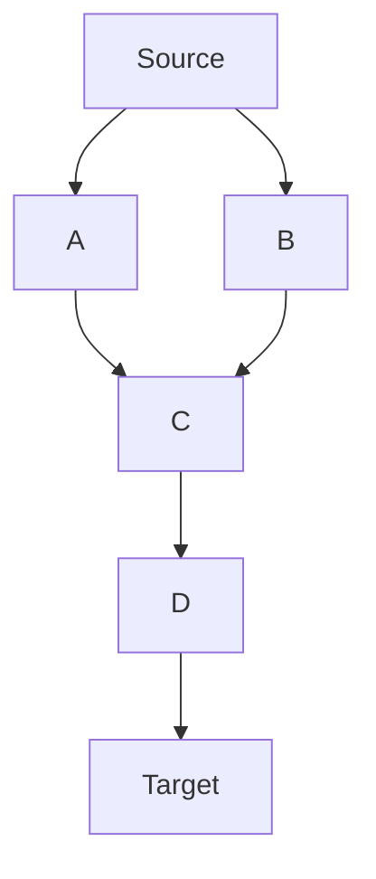

# Theory & Background

## Allosteric Network Analysis
Allosteric network analysis treats a protein as a graph, where each node is a residue and edges represent communication or energy transfer. This approach helps identify key residues (hubs, relays, sources) that mediate allosteric signaling.

### Key Concepts
- **Allostery:** Regulation of protein activity through binding or perturbation at a site distant from the active site.
- **Network Representation:** Residues as nodes, interactions as edges (based on distance, correlation, or energy transfer).
- **Signal Propagation:** How a perturbation at one site affects distant regions.

## Propagation Coefficient (PC)
The Propagation Coefficient (PC) quantifies a residue's ability to transmit a perturbation through the network. It is defined as:

$$
PC(i) = \frac{m_i \cdot n_i}{\sum_j m_j n_j + l}
$$

Where:
- $m_i$ = in-degree (number of incoming edges)
- $n_i$ = out-degree (number of outgoing edges)
- $l$ = number of edges bypassing the current layer

### Biological Interpretation
- **High PC:** Residues that efficiently propagate signals (super-hubs, amplifiers).
- **Low PC:** Relays, collectors, or isolated nodes.

## Example: Layered Network

- S: Source residue (perturbation site)
- T: Target residue (signal endpoint)
- A, B, C, D: Intermediate nodes with different roles

## Further Reading
- [PMC3195717](https://pmc.ncbi.nlm.nih.gov/articles/PMC3195717/)
- [PMC3282753](https://pmc.ncbi.nlm.nih.gov/articles/PMC3282753/)
- [Tandfonline 2013](https://www.tandfonline.com/doi/full/10.1080/07391102.2013.855145?needAccess=true#d1e164)
