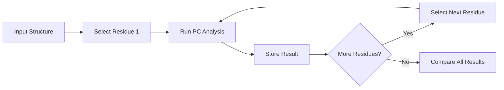

# Example: Systematic Residue Scan

Below is a schematic example of a systematic residue scan for perturbation analysis. Each residue is perturbed in turn, and the resulting propagation coefficient (PC) is plotted for comparison.

---

## Schematic Workflow



---

## Example Plot


---

## Example Table

| Residue | PC Value |
|---------|----------|
| 45      | 0.82     |
| 67      | 0.76     |
| 120     | 0.91     |
| ...     | ...      |

---

## Example Code Snippet

```python
import pandas as pd
import matplotlib.pyplot as plt

# Example data
data = {'Residue': [45, 67, 120], 'PC': [0.82, 0.76, 0.91]}
df = pd.DataFrame(data)

plt.bar(df['Residue'], df['PC'])
plt.xlabel('Residue')
plt.ylabel('Propagation Coefficient (PC)')
plt.title('Systematic Residue Scan')
plt.show()
```

---

## Visual Example: GUI Selection


